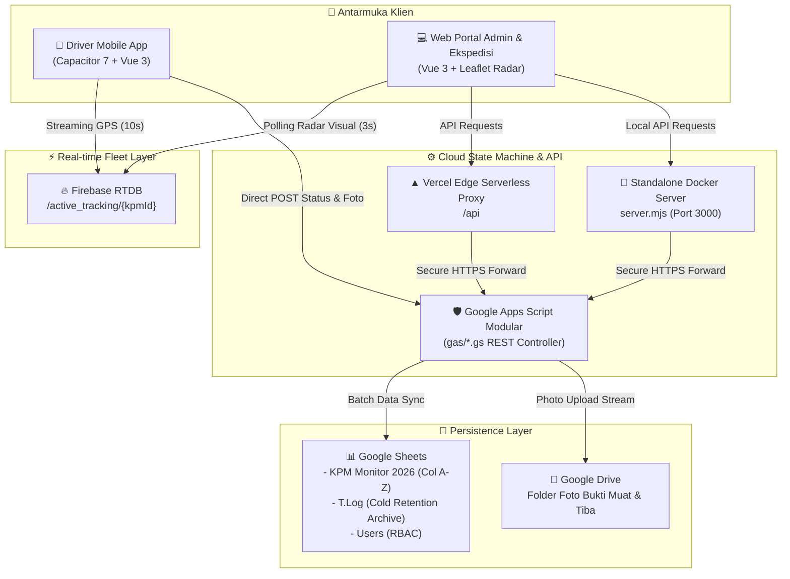
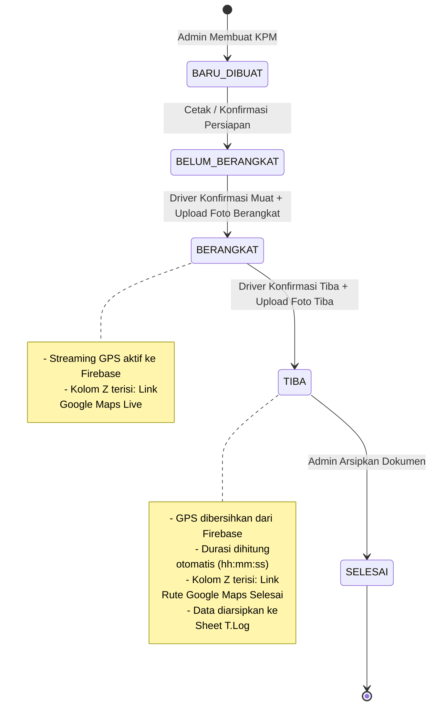

# KPM Line Feeding Tracking System 📦⚡

<div align="center">


<p align="center">
  <b>Sistem Manajemen & Pelacakan Kartu Permintaan Material (KPM) Line Feeding Terpadu</b><br>
  Real-time Fleet Radar • Strict State Machine • Google Sheets Cloud Database • Hybrid Web & Mobile Native Architecture
</p>

[🌐 Live Web Portal](https://combined-app-eight.vercel.app) • [📱 Download Driver APK](https://github.com/SepTGut/KPMscirpt/releases) • [📇 Akses Kartu QR](assets/qr-codes/print_qr_codes.html)

</div>

---

## Daftar Isi

- [Arsitektur Sistem](#arsitektur-sistem)
- [Struktur Repositori Monorepo](#struktur-repositori-monorepo)
- [Fitur Utama](#fitur-utama)
- [Alur State Machine Status KPM](#alur-state-machine-status-kpm)
- [Modul Backend Google Apps Script](#modul-backend-google-apps-script)
- [Struktur Database Spreadsheet (Kolom A-Z)](#struktur-database-spreadsheet-kolom-a-z)
- [Hak Akses & Keamanan Sistem](#hak-akses--keamanan-sistem)
- [Panduan Instalasi & Deployment](#panduan-instalasi--deployment)
  - [1. Jalankan via Docker (Lokal)](#1-jalankan-via-docker-lokal)
  - [2. Deploy Web Portal (Vercel)](#2-deploy-web-portal-vercel)
  - [3. Deploy Backend Google Apps Script](#3-deploy-backend-google-apps-script)
  - [4. Build APK Driver Android](#4-build-apk-driver-android)
  - [5. Menjalankan Lokal Development](#5-menjalankan-lokal-development)
- [Perintah Pintas Automasi (up & syc)](#perintah-pintas-automasi-up--syc)
- [Pengujian Otomatis & Diagnostik](#pengujian-otomatis--diagnostik)
- [Tentang Pembuat & Lisensi](#tentang-pembuat--lisensi)

---

## Arsitektur Sistem

Sistem ini menggabungkan ekosistem **Google Cloud**, **Firebase Realtime Database**, **Vercel Edge**, **Docker Containers**, dan **Android Native**.



---

## Struktur Repositori Monorepo

```text
KPMscirpt/
├── .agents/                 # AI agents, rules & automated workflows
├── .github/                 # GitHub Actions CI/CD workflows
│   ├── workflows/ci.yml     # Build test & cryptographic seal validator
│   ├── workflows/lint.yml   # Markdown standards validator
│   └── workflows/release-apk.yml # Automated signed APK publisher
├── apps/                    # Aplikasi Klien
│   ├── web/                 # Unified Vue 3 Web Application (Admin, Radar, Driver)
│   │   ├── api/             # Vercel Serverless Function Proxy
│   │   ├── src/             # Vue 3 source (Composables, Components, Services)
│   │   ├── Dockerfile       # Multi-stage production container
│   │   └── server.mjs       # Standalone high-performance Node.js server
│   └── mobile/              # Native Android Driver App (Capacitor 7)
│       ├── android/         # Android Native project & Gradle Wrapper
│       ├── releases/        # File APK Release (Signed/Unsigned)
│       └── build-apk.ps1    # Script kompilasi 1-klik APK
├── gas/                     # Backend Google Apps Script (Clasp rootDir: "gas")
│   ├── About.gs             # Proteksi Digital Seal Anti-Tamper Kriptografis
│   ├── Auth.gs              # Autentikasi User, QR Tokens & ST Master Bypass
│   ├── Code.gs              # Custom Menu Spreadsheet & Trigger Lifecycle
│   ├── FixFormat.gs         # Utilitas Normalisasi Nomor 3-Digit & Format Kolom
│   ├── Gps.gs               # Generator Link GPS, Router & Sheet T.Log
│   ├── KpmAction.gs         # Mutasi KPM, Edit Material & State Machine
│   ├── KpmMonitor.gs        # Engine Query Monitoring & In-Memory Caching
│   ├── KPMn.gs              # Konstanta Kolom, Print KPM & Formula Spreadsheet
│   ├── Router.gs            # HTTP Dispatcher (doGet/doPost) & Concurrency Lock
│   ├── Storage.gs           # Manajemen Folder & Upload Foto Google Drive
│   ├── WebConfig.gs         # System Enums, Error Envelope & Formula Injection Sanitizer
│   └── appsscript.json      # Manifest Google Apps Script
├── assets/                  # Aset Proyek & Dokumen Fisik
│   └── qr-codes/            # File PNG QR Code & Template Cetak Kartu ID A4
├── docs/                    # Dokumentasi Teknis & Riwayat Proyek
│   ├── changelog.md         # Catatan pembaruan per rilis
│   └── archive/             # Arsip historis
├── scripts/                 # Development & Sync CLI Tools
│   ├── seal_integrity.mjs  # Generator segel integritas kriptografis
│   ├── deep_scan.mjs       # Static analysis audit & dependency checker
│   ├── git-sync.ps1        # Sinkronisasi multi-branch prioritas main
│   ├── test_gps.mjs        # Simulator armada GPS 26 titik interpolasi
│   └── sync-gas.ps1        # Tool interaktif Clasp push & watch
├── docker-compose.yml       # Production container orchestration
├── database.rules.json      # Firebase RTDB Security Rules
├── package.json             # Root monorepo automation scripts
└── README.md                # Dokumentasi arsitektur utama
```

---

## Fitur Utama

- 🗺️ **Live Fleet GPS Radar (Leaflet.js & Firebase Realtime Database)**:
  - Pelacakan posisi armada truk bergerak secara visual di atas peta interaktif.
  - Animasi denyut radar dan orientasi rotasi truk sesuai sudut hadap (*heading*).
  - Jejak garis lintasan biru (*breadcrumb polyline*) merekam rute aktual perjalanan.
  - Titik landmark 4 Workshop Utama (*Candi Sewu, Tiron, Sukosari, Remul*).
- 📱 **Aplikasi Mobile Driver Native (Android APK)**:
  - Dibangun dengan tema **Google Material Design 3**.
  - Background Geolocation Watcher otomatis membaca GPS saat status *"Jalan"*.
  - Tombol 1-klik navigasi *turn-by-turn* Google Maps langsung ke workshop tujuan.
  - Kompresi instan kamera (<150KB) untuk penghematan bandwidth operator lapangan.
- 📋 **Penomoran KPM Cerdas & Terstandarisasi 3-Digit**:
  - Penomoran otomatis terkunci pada format 3-digit: `001/PPO/LF/IX/2026` ➔ `010` ➔ `011` ➔ `100`.
  - Dilengkapi modul [FixFormat.gs](file:///d:/MyCode/KPMscirpt/gas/FixFormat.gs) untuk merapikan data lama yang kelebihan digit secara massal dalam 1-klik.
- ⚡ **Zero Single-Cell Loop Writes Performance**:
  - Seluruh manipulasi spreadsheet dilakukan in-memory RAM menggunakan 2D array dan ditulis serentak dalam 1 panggilan `setValues()` batch.
- 🔒 **Spreadsheet Formula Injection Defense**:
  - Sanitasi otomatis karakter berbahaya (`=`, `+`, `-`, `@`) untuk mencegah eksekusi formula liar dari input pengguna eksternal.
- 👑 **Super Admin "ST" Secret Recovery Door**:
  - Akun master kebal penghapusan (*invisible from spreadsheet*), tidak dapat di-brute force, dan diakses eksklusif melalui token rahasia `st_master_access_99x`.

---

## Alur State Machine Status KPM



---

## Modul Backend Google Apps Script

| File Modul | Peran & Tanggung Jawab |
| :--- | :--- |
| [`WebConfig.gs`](gas/WebConfig.gs) | Konfigurasi sistem, konstanta status, enum role, format response envelope, sanitasi injeksi formula. |
| [`Auth.gs`](gas/Auth.gs) | Autentikasi pengguna, manajemen sheet `Users`, verifikasi QR Token, dan Super Admin "ST" Bypass. |
| [`Storage.gs`](gas/Storage.gs) | Pengelolaan folder Google Drive, streaming upload foto bukti, dan deduplikasi berkas. |
| [`KpmMonitor.gs`](gas/KpmMonitor.gs) | Query agregasi data monitoring KPM, Master Data workshop/PIC/UOM, dan in-memory cache engine. |
| [`KpmAction.gs`](gas/KpmAction.gs) | Mesin mutasi pembuatan KPM multi-item, state machine transisi status, dan pengarsipan data. |
| [`Router.gs`](gas/Router.gs) | Dispatcher HTTP `doGet` & `doPost`, penanganan concurrency via `LockService`, dan verifikasi integritas. |
| [`FixFormat.gs`](gas/FixFormat.gs) | Normalisasi nomor KPM ke format 3-digit, perataan teks (Center/Left/Middle), dan standardisasi grid border. |
| [`Gps.gs`](gas/Gps.gs) | Pemrosesan URL Google Maps Live/Directions, konfigurasi Firebase, dan arsip data dingin ke sheet `T.Log`. |
| [`KPMn.gs`](gas/KPMn.gs) | Engine spreadsheet, konstanta kolom A-Z, generator formula, dan modul cetak fisik KPM. |
| [`About.gs`](gas/About.gs) | Segel tanda tangan digital kriptografis SHA-256 untuk perlindungan anti-tamper. |

---

## Struktur Database Spreadsheet (Kolom A-Z)

Setiap pengiriman dicatat pada sheet **`KPM Monitor 2026`** dengan format kolom terstandarisasi:

| Kolom | Nama Header | Tipe Data | Alignment | Keterangan |
| :---: | :--- | :--- | :---: | :--- |
| **A** | `NO` | Integer | Center | Nomor baris otomatis (1, 2, 3...) |
| **B** | `POST DATE` | Date | Center | Tanggal posting KPM (`dd/MM/yyyy`) |
| **C** | `NO LF` | Text | Center | Nomor unik KPM 3-digit (`001/PPO/LF/IX/2026`) |
| **D** | `ITEM` | Integer | Center | Nomor urut material dalam KPM |
| **E** | `KODE MATERIAL` | Text | Center | Kode identifikasi barang / material |
| **F** | `SPESIFIKASI` | Text | Left | Nama lengkap & spesifikasi teknis barang |
| **G** | `WBS` | Text | Left | Work Breakdown Structure kode proyek |
| **H** | `PROYEK` | Text | Left | Nama proyek pemesan |
| **I** | `TYPE CAR` | Text | Center | Tipe kendaraan pengangkut |
| **J** | `TS / BATCH` | Text | Center | Nomor batch / set pengerjaan |
| **K** | `QTY DIMINTA` | Number | Center | Jumlah kuantitas yang diajukan |
| **L** | `QTY DISERAHKAN` | Number | Center | Jumlah aktual yang diserahkan |
| **M** | `UOM` | Text | Center | Satuan ukuran (`PCS`, `SET`, `UNIT`, dll.) |
| **N** | `S/N` | Text | Center | Serial number / nomor seri unit |
| **O** | `PIC KPM` | Text | Center | Nama penanggung jawab pembuatan KPM |
| **P** | `KETERANGAN` | Text | Left | Catatan tambahan logistik |
| **Q** | `WS AWAL` | Text | Center | Workshop lokasi muat asal |
| **R** | `WS TUJUAN` | Text | Center | Workshop lokasi bongkar tujuan |
| **S** | `DRIVER` | Text | Center | Nama personil pengemudi armada |
| **T** | `WAKTU BERANGKAT` | DateTime | Center | Waktu aktual armada berangkat |
| **U** | `WAKTU TIBA` | DateTime | Center | Waktu aktual armada tiba di tujuan |
| **V** | `DURASI` | Time | Center | Durasi total perjalanan (`hh:mm:ss`) |
| **W** | `STATUS TRACKING` | Text | Center | Status aktif (`BARU DIBUAT` s/d `SELESAI`) |
| **X** | `FOTO BERANGKAT` | Formula | Center | Hyperlink Google Drive bukti muat |
| **Y** | `FOTO TIBA` | Formula | Center | Hyperlink Google Drive bukti tiba |
| **Z** | `GPS TRACK` | Formula | Center | Hyperlink Google Maps Live Track / Selesai |

---

## Hak Akses & Keamanan Sistem

| Fitur / Operasi | 👑 Super Admin (ST) | 🛡️ Admin Biasa | 🚚 Driver / User |
| :--- | :---: | :---: | :---: |
| **Pembuatan KPM Baru** | ✅ | ✅ | ❌ |
| **Edit Material & Qty** | ✅ | ✅ | ❌ |
| **Update Status Pengiriman** | ✅ | ✅ | ✅ |
| **Live Radar Armada (Peta)** | ✅ | ✅ | ❌ |
| **Arsip & Hapus KPM** | ✅ | ✅ | ❌ |
| **Status di Sheet `Users`** | 👻 *Invisible* | 📝 Terdaftar | 📝 Terdaftar |
| **Jalur Login Utama** | 🔑 Secret Link / Token | 📋 Form PIN / Google / QR | 📇 Scan Kartu QR |

---

## Panduan Instalasi & Deployment

### 1. Jalankan via Docker (Lokal)

Menjalankan server web mandiri lengkap dengan API proxy dan serving static asset (<15MB RAM):

```bash
# Build dan jalankan container di background
npm run docker:up

# Hentikan container
npm run docker:down
```

Aplikasi langsung live di 👉 `http://localhost:3000`.

### 2. Deploy Web Portal (Vercel)

Deploy frontend Vue 3 dan Edge Serverless Function Proxy ke Vercel:

```bash
npm run deploy:vercel
```

Production URL: 👉 **[https://combined-app-eight.vercel.app](https://combined-app-eight.vercel.app)**

### 3. Deploy Backend Google Apps Script

Push seluruh modul backend dari folder `gas/` dan validasi segel integritas kriptografis:

```bash
# Update segel integritas dan push ke Apps Script
npm run gas:push

# Push dan deploy versi baru ke Deployment ID aktif
npx @google/clasp deploy -i AKfycbz1XwsnPkZ7-gqV8CMgeg0GWpp6jLn13nR_CTqSWppVgYwr4IpqSIA710W8OUQz43g2IA -d "Production Release"
```

### 4. Build APK Driver Android

```bash
cd apps/mobile
npm install
npm run build
npx cap sync android
./build-apk.ps1
```

File output APK siap install: `apps/mobile/releases/Driver-KPM-v1.0-Signed.apk`.

### 5. Menjalankan Lokal Development

1. **Jalankan Web App (Vite Dev Server)**:

   ```bash
   cd apps/web
   npm run dev
   ```

2. **Jalankan Docker Container**:

   ```bash
   npm run docker:up
   ```

---

## Perintah Pintas Automasi (up & syc)

Proyek ini mendukung shortcut automasi workflow:

### 🟢 Ketik `"up"` (Upload, Commit & Push)

Otomatis melakukan staging, pembuatan conventional commit, push branch aktif, sinkronisasi Google Apps Script (`npm run gas:push`), dan pembaruan knowledge graph.

### 🔵 Ketik `"syc"` (Cross-Branch Sync Prioritas `main`)

Menyinkronkan seluruh branch kerja dengan prioritas utama ke branch **`main`**:

```bash
npm run git:sync
```

*(Merge branch aktif ➔ Push `main` ➔ Propagasi `main` ke `Beta` & `Apps(personel)` ➔ Kembali ke branch asal).*

---

## Pengujian Otomatis & Diagnostik

1. **Audit Statis & Pemeriksaan Integritas Monorepo**:

   ```bash
   node scripts/deep_scan.mjs
   ```

2. **Uji Simulasi Live GPS Armada (26 Titik Gerak Halus)**:

   ```bash
   npm run test:gps:simulate
   ```

3. **Verifikasi Segel Kriptografis Digital**:

   ```bash
   npm run gas:integrity
   ```

4. **Validasi Standar Markdown**:

   ```bash
   npx markdownlint-cli README.md
   ```

---

## Tentang Pembuat & Lisensi

- **Pengembang:** Setyo Guntur Samudro
- **Instansi:** SMK Negeri 1 Madiun
- **Jurusan / Kompetensi:** T.I.T.L (Teknik Instalasi Tenaga Listrik)
- **Sistem:** KPM Line Feeding Tracking System (v8.0.0, 2026)
- **Keamanan & Lisensi:** Hak cipta dan logika bisnis dilindungi modul integritas digital [`About.gs`](gas/About.gs).
