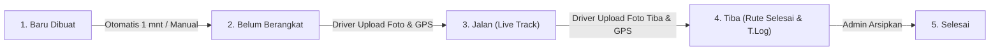

# KPM Line Feeding Tracking System 📦🚀

> **Sistem Informasi & Manajemen Kartu Permintaan Material (KPM) Line Feeding Real-time**  
> Mengintegrasikan Google Sheets sebagai basis data utama, Google Apps Script sebagai backend API & state machine, Firebase Realtime Database untuk streaming posisi GPS armada, Leaflet.js Interactive Live Radar, Google Drive sebagai media penyimpanan bukti foto, antarmuka Web Portal responsif (Netlify & Vercel), dan Aplikasi Mobile Driver Android Native (APK) berdesain **Google Material Design 3**.

---

## 📑 Daftar Isi

- [Arsitektur Sistem](#arsitektur-sistem)
- [Fitur Utama](#fitur-utama)
- [Real-Time Fleet GPS Tracking & Leaflet Radar](#real-time-fleet-gps-tracking--leaflet-radar)
- [Aplikasi Mobile Driver Android (APK)](#aplikasi-mobile-driver-android-apk)
- [Desain Antarmuka Google Material Design 3](#desain-antarmuka-google-material-design-3)
- [Arsitektur Performa dan Caching](#arsitektur-performa-dan-caching)
- [Alur Status State Machine](#alur-status-state-machine)
- [Struktur Spreadsheet Kolom A Sampai Z & Sheet T.Log](#struktur-spreadsheet-kolom-a-sampai-z--sheet-tlog)
- [Keamanan dan Hak Akses RBAC](#keamanan-dan-hak-akses-rbac)
- [Spesifikasi API Backend & Modul Gps.gs](#spesifikasi-api-backend--modul-gpsgs)
- [Panduan Instalasi dan Deployment](#panduan-instalasi-dan-deployment)
  - [1. Konfigurasi Google Apps Script](#1-konfigurasi-google-apps-script)
  - [2. Konfigurasi Web Portal (Netlify / Vercel)](#2-konfigurasi-web-portal-netlify--vercel)
  - [3. Build & Rilis APK Driver Android](#3-build--rilis-apk-driver-android)
  - [4. Menjalankan Lokal Development](#4-menjalankan-lokal-development)
- [Perintah Pintas Git & Sinkronisasi (up & syc)](#perintah-pintas-git--sinkronisasi-up--syc)
- [Akses QR Code dan Link Unduhan](#akses-qr-code-dan-link-unduhan)
- [Pengujian Otomatis & Simulasi Radar](#pengujian-otomatis--simulasi-radar)
- [Lisensi dan Pembuat](#lisensi-dan-pembuat)

---

## Arsitektur Sistem

```text
┌────────────────────────────────────────────────────────────────────────┐
│               APLIKASI DRIVER ANDROID (apps/driver-app)                │
│   - Vue 3 + Tailwind CSS (Google Material Design 3 Theme)              │
│   - Capacitor 7 Native Android Engine                                  │
│   - GPS Geolocation Watcher per 10 Detik saat Status "Jalan"           │
│   - Tombol 1-Klik Buka Navigasi Google Maps ke Workshop Tujuan        │
│   - Perekaman Koordinat GPS Checkpoint saat Pengambilan Foto Bukti    │
│   - Koneksi Langsung (Direct API) ke Google Apps Script tanpa Proxy    │
└──────────────┬───────────────────────────────────────────┬─────────────┘
               │ Streaming GPS Koordinat Realtime          │ Direct HTTPS POST / GET
               ▼                                           ▼
┌──────────────────────────────────────┐   ┌─────────────────────────────┐
│      FIREBASE REALTIME DATABASE      │   │    BACKEND GOOGLE APPS      │
│  /active_tracking/{kpmId}.json       │   │    SCRIPT (Web.gs & Gps.gs) │
│ - Koordinat Latitude / Longitude     │   │ - Strict State Machine      │
│ - Kecepatan (km/h) & Heading Sudut   │   │ - Formula Kolom Z Auto Link │
│ - Nama Driver & Rute Asal ➔ Tujuan   │   │ - Arsip Otomatis Sheet T.Log│
└──────────────────┬───────────────────┘   └──────────────┬──────────────┘
                   │ Aliran Data Radar                    │
                   ▼                                      ▼
┌──────────────────────────────────────┐   ┌─────────────────────────────┐
│      WEB ADMIN PORTAL (Leaflet)      │   │   DATABASE GOOGLE SHEETS    │
│  - Tab 🗺️ Live Radar Armada           │   │ - Sheet: "KPM Monitor 2026" │
│  - Animasi Radar Denyut & Gliding    │   │   (26 Kolom: A s/d Z)       │
│  - Jejak Garis Lintasan (Breadcrumb) │   │ - Sheet: "T.Log"            │
│  - Fokus Kendaraan & Pop-up Rute     │   │   (Cold Retention Archival) │
└──────────────────────────────────────┘   └─────────────────────────────┘
```

---

## Fitur Utama

1. **Live Fleet Radar & Tracking GPS (Leaflet.js & Firebase Realtime Database)**:
   - Pelacakan posisi armada truk berjalan secara visual di atas peta interaktif.
   - Pergerakan marker halus (*smooth motion interpolation*) dengan animasi denyut radar dan rotasi sudut hadap (*heading*).
   - Jejak garis lintasan biru (*breadcrumb polyline trail*) yang merekam rute yang telah ditempuh.
   - Deteksi titik 4 Workshop Utama (*Candi Sewu, Tiron, Sukosari, Remul*).

2. **Kolom Z: `GPS Track` & Google Maps Router Otomatis**:
   - **Saat Status 'Jalan'**: Kolom Z otomatis terisi tautan posisi live driver:  
     `=HYPERLINK("https://www.google.com/maps?q=lat,lng"; "🔴 Live Track")`
   - **Saat Status 'Tiba'**: Kolom Z otomatis terisi formula rute Google Maps Directions lengkap:  
     `=HYPERLINK("https://www.google.com/maps/dir/?api=1&origin=latA,lngA&destination=latB,lngB&travelmode=driving"; "🗺️ Rute Selesai")`

3. **Retensi & Pengarsipan Jangka Panjang (`T.Log`)**:
   - Tab sheet **`T.Log`** menyimpan riwayat logistik dingin (*cold retention*) setiap kali KPM berstatus "Tiba" lengkap dengan rincian durasi, link rute, dan foto bukti.

4. **Aplikasi Mobile Driver Android Native**:
   - Antarmuka khusus smartphone berbasis Google Material Design 3.
   - Pelacak GPS otomatis saat pengiriman berlangsung.
   - Tombol 1-klik navigasi turn-by-turn Google Maps langsung ke workshop tujuan.
   - Pengambilan foto langsung dari kamera dengan kompresi kilat di background thread (<1 detik).

5. **Modul Mandiri Backend Google Apps Script**:
   - [`Gps.gs`](file:///d:/MyCode/KPMscirpt/Gps.gs): Modul dedicated pemrosesan link koordinat GPS, router URL, konfigurasi Firebase, dan arsip `T.Log`.
   - [`Web.gs`](file:///d:/MyCode/KPMscirpt/Web.gs): Single source of truth state machine KPM, multi-material generator, dan otentikasi token.
   - [`KPMn.gs`](file:///d:/MyCode/KPMscirpt/KPMn.gs): Mesin spreadsheet, konstanta kolom A–Z, dan modul cetak fisik KPM.
   - [`About.gs`](file:///d:/MyCode/KPMscirpt/About.gs): Proteksi tanda tangan digital kriptografis anti-tamper.

---

## Real-Time Fleet GPS Tracking & Leaflet Radar

Sistem pelacakan armada menggunakan arsitektur hybrid berperforma tinggi:
- **Pengiriman Koordinat:** Driver App membaca GPS via Geolocation API per 10 detik dan mem-push snapshot posisi langsung ke Firebase REST API `/active_tracking/{kpmId}.json`.
- **Konsumsi Data di Admin:** Peta Web Admin melakukan polling data tiap 3 detik dan memperbarui marker di layar tanpa *page refresh*.
- **Pembersihan Otomatis:** Ketika driver menekan konfirmasi *"Tiba"*, node di Firebase otomatis dihapus untuk menjaga ukuran database Firebase tetap ramping (<5MB permanen).

---

## Aplikasi Mobile Driver Android (APK)

Aplikasi mobile driver terletak pada direktori [`apps/driver-app`](file:///d:/MyCode/KPMscirpt/apps/driver-app) dan dikompilasi menjadi file APK mandiri.

### Keunggulan Driver App

- **Koneksi Langsung ke Google Apps Script**: Bebas dari kendala redirect autentikasi SSO dan langsung terhubung ke Google Sheets.
- **Izin GPS Akurasi Tinggi**: Dikonfigurasi dengan `ACCESS_FINE_LOCATION` dan `ACCESS_COARSE_LOCATION` di Android Manifest.
- **Signed Keystore Resmi**: Dibundel dengan signature release resmi untuk mencegah peringatan keamanan *Google Play Protect*.
- **Kompresi Gambar Cepat**: Mengompresi foto bukti muat dan tiba ke resolusi optimal 960px (~150KB) dalam hitungan milidetik.
- **Rilis Otomatis GitHub Actions**: Setiap push atau rilis versi tag (misal: `v1.0.2`) secara otomatis mengompilasi, menandatangani, dan merilis file `.apk` siap unduh di tab **GitHub Releases**.

---

## Desain Antarmuka Google Material Design 3

Seluruh antarmuka web, mobile, dan dialog Google Apps Script distandardisasi mengikuti panduan desain **Google Material Design 3 (M3)**:

### 1. Psikologi Warna (Google 4-Color Palette)
- **Google Blue** (`#1a73e8` / `#4285f4`): Kepercayaan & Aksi Utama (Header, tombol navigasi, chip KPM, dan rute asal).
- **Google Red** (`#ea4335` / `#d93025`): Urgensi & Peringatan (Banner error, tombol reset foto, dan validasi gagal).
- **Google Yellow / Amber** (`#fbbc04` / `#f9ab00`): Optimisme & Status Berjalan (Badge status "Sedang Jalan", in-transit stepper).
- **Google Green** (`#34a853` / `#188038`): Pertumbuhan & Sukses (Status tiba di tujuan, konfirmasi berhasil, rute tujuan).

### 2. Gradien & Kedalaman Visual
- Garis aksen pelangi 4 warna Google (`linear-gradient(90deg, #4285f4, #ea4335, #fbbc04, #34a853)`).
- Efek elevasi berlapis Material 3 (`shadow-m3-1` hingga `shadow-m3-4`).
- Glassmorphism lembut pada header dialog dan top bar.

---

## Arsitektur Performa dan Caching

1. **Multi-Tier Caching (RAM ➔ `ScriptCache` ➔ Storage)**:
   - **Katalog Material (`Code.gs`)**: Seluruh database material di-load ke RAM dan `ScriptCache` (TTL 6 jam).
   - **Aset Gambar / Logo (`Code.gs` & `About.gs`)**: Logo aplikasi dan header cetak di-cache 3 lapis untuk menghilangkan latensi DriveApp RPC.
   - **Target Google Drive Folder (`Web.gs`)**: ID folder tujuan pengiriman di-cache di `ScriptCache`.

2. **Optimasi Spreadsheet I/O & Network Payload**:
   - **Selective Formula Fetch**: Pembacaan monitoring hanya meminta formula pada 3 kolom formula (Foto Berangkat, Foto Tiba, GPS Track).
   - **Selective Slice Write-Back**: Pembaruan status KPM hanya menulis kembali irisan baris yang berubah (`allData.slice(minIdx, maxIdx + 1)`).

---

## Alur Status State Machine



| Status | Kode Status | Hak Akses | Deskripsi & Syarat Transisi |
| :--- | :---: | :---: | :--- |
| **Baru Dibuat** | `BARU_DIBUAT` | Admin | Status awal saat KPM dibuat oleh Admin. KPM belum siap diambil driver. |
| **Belum Berangkat** | `BELUM_BERANGKAT` | Admin / Sistem | Otomatis berubah setelah 1 menit atau diubah admin. KPM muncul di portal Driver. |
| **Jalan** | `BERANGKAT` | Driver / Admin | Driver memulai perjalanan. **Wajib foto muat & GPS**. Kolom Z terisi *🔴 Live Track*. |
| **Tiba** | `TIBA` | Driver / Admin | Driver sampai di tujuan. **Wajib foto tiba & GPS**. Kolom Z terisi *🗺️ Rute Selesai* & tersimpan ke `T.Log`. |
| **Selesai** | `SELESAI` | Admin | KPM telah tuntas dan diarsipkan dari pantauan monitoring harian. |

---

## Struktur Spreadsheet Kolom A Sampai Z & Sheet T.Log

Data KPM disimpan pada sheet **`KPM Monitor 2026`** (26 Kolom):

| Kolom | Nama Kolom di Spreadsheet | Konstanta di Script | Tipe Data | Deskripsi |
| :---: | :--- | :--- | :---: | :--- |
| **A** | `NO ( Oto )` | `MONITOR_COL_NO` (1) | Integer | Nomor urut baris data |
| **B** | `Post Date ( Otomatis )` | `MONITOR_COL_POST_DATE` (2) | String | Waktu pembuatan (`dd/MM/yyyy HH:mm:ss`) |
| **C** | `No. LF ( Counting Manual )` | `MONITOR_COL_NOLF` (3) | String | Nomor KPM unik (`001/PPO/LF/VIII/2026`) |
| **D** | `Item` | `MONITOR_COL_ITEM` (4) | Integer | Urutan item material (`1`, `2`, `3`, ...) |
| **E** | `Kode Material` | `MONITOR_COL_KODE` (5) | String | Kode material dari database |
| **F** | `Spesifikasi ( Semi - Otomatis )` | `MONITOR_COL_SPEK` (6) | String | Nama / deskripsi material |
| **G** | `WBS` | `MONITOR_COL_WBS` (7) | String | Kode WBS proyek |
| **H** | `Proyek` | `MONITOR_COL_PROYEK` (8) | String | Nama proyek tujuan |
| **I** | `Type Car` | `MONITOR_COL_TYPECAR` (9) | String | Tipe car / gerbong |
| **J** | `TS/Batch/Set` | `MONITOR_COL_BATCH` (10) | String | Nomor batch / set |
| **K** | `Qty Diminta` | `MONITOR_COL_QTY` (11) | Number | Jumlah barang diminta |
| **L** | `Qty Diserahkan` | `MONITOR_COL_QTYDISERAHKAN` (12) | Number | Jumlah barang diserahkan |
| **M** | `UoM` | `MONITOR_COL_UOM` (13) | String | Satuan (`PCS`, `M`, `UNIT`, `SET`, `SHT`, dll.) |
| **N** | `SN` | `MONITOR_COL_SN` (14) | String | Serial Number |
| **O** | `PIC KPM` | `MONITOR_COL_PIC` (15) | String | Nama PIC penanggung jawab |
| **P** | `Keteranagn` | `MONITOR_COL_KET` (16) | String | Keterangan tambahan |
| **Q** | `Dari` | `MONITOR_COL_WSAWAL` (17) | String | Workshop asal keberangkatan |
| **R** | `Tujuan` | `MONITOR_COL_WSTUJUAN` (18) | String | Workshop tujuan kedatangan |
| **S** | `Driver` | `MONITOR_COL_DRIVER` (19) | String | Nama pengemudi armada |
| **T** | `Waktu Berangkat` | `MONITOR_COL_WKT_BERANGKAT` (20) | String | Waktu keberangkatan (`HH:mm:ss`) |
| **U** | `Waktu Tiba` | `MONITOR_COL_WKT_TIBA` (21) | String | Waktu ketibaan (`HH:mm:ss`) |
| **V** | `Durasi` | `MONITOR_COL_DURASI` (22) | String | Durasi otomatis (`HH:mm:ss`) |
| **W** | `Status Tracking` | `MONITOR_COL_STATUS` (23) | String | Dropdown validasi status KPM |
| **X** | `Foto Berangkat` | `MONITOR_COL_FOTO_BER` (24) | Formula | `=HYPERLINK("drive_url", "[Link Foto]")` |
| **Y** | `Foto Tiba` | `MONITOR_COL_FOTO_TIB` (25) | Formula | `=HYPERLINK("drive_url", "[Link Foto]")` |
| **Z** | `GPS Track` | `MONITOR_COL_GPS_TRACK` (26) | Formula | `=HYPERLINK("gmaps_url", "🔴 Live" / "🗺️ Rute")` |

---

## Keamanan dan Hak Akses RBAC

| Aksi API | Endpoint Method | Peran ADMIN | Peran DRIVER / USER | Keterangan |
| :--- | :---: | :---: | :---: | :--- |
| `getMasterData` | `GET` | ✅ Diizinkan | ✅ Diizinkan | Mengambil workshop, PIC, UOM, status, dan DB URL |
| `getMonitoring` | `GET` | ✅ Diizinkan | ❌ Ditolak (403) | Mengambil daftar KPM aktif beserta progres |
| `getDeliveries` | `GET` | ✅ Diizinkan | ✅ Diizinkan | Mengambil KPM yang siap diupdate driver |
| `createKpm` | `POST` | ✅ Diizinkan | ❌ Ditolak (403) | Membuat KPM dan baris material baru |
| `updateStatus` | `POST` | ✅ Diizinkan | ✅ Diizinkan | Update status, foto, koordinat GPS, durasi |
| `archiveKpm` | `POST` | ✅ Diizinkan | ❌ Ditolak (403) | Mengubah status menjadi `Selesai` |

---

## Spesifikasi API Backend & Modul Gps.gs

### Fungsi Modul [`Gps.gs`](file:///d:/MyCode/KPMscirpt/Gps.gs):
- `getFirebaseConfig()`: Mengambil `FIREBASE_DB_URL` dari Script Properties.
- `createGpsLiveUrl(coord)`: Membuat hyperlink titik lokasi driver live.
- `createGpsRouterUrl(origin, dest)`: Membuat hyperlink router petunjuk arah mengemudi.
- `extractCoordinatesFromUrl(url)`: Mengekstrak koordinat dari link Google Maps yang tersimpan.
- `setupTLogSheet()`: Menginisialisasi tabel sheet arsip `T.Log`.
- `appendTLogRecord(record)`: Menambahkan rekaman perjalanan selesai ke sheet `T.Log`.
- `setupTrackingHeaders()`: Mengonfigurasi header Kolom S–Z dan menyiapkan sheet `T.Log`.

---

## Panduan Instalasi dan Deployment

### 1. Konfigurasi Google Apps Script

1. Buka spreadsheet Google Sheets Anda.
2. Buka **Extensions** → **Apps Script**.
3. File-file backend:
   - [`Gps.gs`](file:///d:/MyCode/KPMscirpt/Gps.gs) (Modul GPS & Retensi T.Log)
   - [`Web.gs`](file:///d:/MyCode/KPMscirpt/Web.gs) (Controller API & State Machine)
   - [`KPMn.gs`](file:///d:/MyCode/KPMscirpt/KPMn.gs) (Engine Spreadsheet & Print Modul)
   - [`Code.gs`](file:///d:/MyCode/KPMscirpt/Code.gs), [`About.gs`](file:///d:/MyCode/KPMscirpt/About.gs), [`Test.gs`](file:///d:/MyCode/KPMscirpt/Test.gs)
4. Atur **Script Properties** di **⚙️ Project Settings**:
   - `ADMIN_TOKEN` = `(Token rahasia Admin Anda)`
   - `DRIVER_TOKEN` = `(Token rahasia Driver Anda)`
   - `FIREBASE_DB_URL` = `https://linefeedingdbt-default-rtdb.asia-southeast1.firebasedatabase.app`
5. Jalankan inisialisasi: Pilih fungsi `setupTrackingHeaders` lalu klik **▶ Run**.
6. Deploy Web App: **Deploy** → **New deployment** (Execute as: `Me`, Who has access: `Anyone`).

### 2. Konfigurasi Web Portal (Netlify / Vercel)

File konfigurasi otomatis telah tersedia:
- **Netlify**: [`WKPM/combined-app/netlify.toml`](file:///d:/MyCode/KPMscirpt/WKPM/combined-app/netlify.toml)
- **Vercel**: [`WKPM/combined-app/vercel.json`](file:///d:/MyCode/KPMscirpt/WKPM/combined-app/vercel.json)

Set Environment Variables:
```env
GOOGLE_SCRIPT_URL=https://script.google.com/macros/s/.../exec
ADMIN_TOKEN=(Token Admin)
DRIVER_TOKEN=(Token Driver)
```

### 3. Build & Rilis APK Driver Android

```bash
cd apps/driver-app
npm install
npm run build
npx cap sync android
cd android
./gradlew assembleRelease
```
File APK: `apps/driver-app/android/app/build/outputs/apk/release/app-release.apk`

---

## Perintah Pintas Git & Sinkronisasi (up & syc)

Proyek ini dilengkapi dengan aturan automasi trigger kata kunci:

### 🟢 Ketik `"up"` (Upload, Commit & Push):
Otomatis menjalankan `git add .`, membuat commit deskriptif, push ke branch aktif, dan push backend GAS (`npm run gas:push`).

### 🔵 Ketik `"syc"` (Cross-Branch Sync Prioritas `main`):
Otomatis menyinkronkan seluruh branch dengan memprioritaskan branch **`main`**:
```bash
npm run git:sync
```
*(Merge branch aktif ke `main` ➔ Push `main` ➔ Propagasi `main` ke `Beta` & `Apps(personel)` ➔ Kembali ke branch asal).*

---

## Akses QR Code dan Link Unduhan

| Portal / Aplikasi | URL Publik / Link Unduhan | QR Code File |
| :--- | :--- | :---: |
| **Aplikasi Driver Mobile (APK)** | **[Unduh di GitHub Releases](https://github.com/SepTGut/KPMscirpt/releases)** | *(File APK Android)* |
| **Web Portal Admin & Radar** | `https://combined-app-theta.vercel.app/kpm` | [`qr code/qr_admin_kpm.png`](file:///d:/MyCode/KPMscirpt/qr%20code/qr_admin_kpm.png) |
| **Web Portal Driver** | `https://combined-app-theta.vercel.app/kpm/personel` | [`qr code/qr_personel_driver.png`](file:///d:/MyCode/KPMscirpt/qr%20code/qr_personel_driver.png) |
| **Kartu Cetak Siap Print** | Buka di browser: [`qr code/print_qr_codes.html`](file:///d:/MyCode/KPMscirpt/qr%20code/print_qr_codes.html) | *(Halaman Cetak A4)* |

---

## Pengujian Otomatis & Simulasi Radar

1. **Uji Otomatis GPS & Operasi Firebase**:
   ```bash
   npm run test:gps
   ```
2. **Uji Simulasi Live Visual Armada (26 Titik Interpolasi Halus)**:
   ```bash
   npm run test:gps:simulate
   ```
3. **Uji Integritas Seal Kriptografis Google Apps Script**:
   ```bash
   npm run gas:integrity
   ```

---

## Lisensi dan Pembuat

- **Pengembang:** Setyo Guntur Samudro
- **Instansi:** SMK Negeri 1 Madiun
- **Jurusan / Fakultas:** T.I.T.L (Teknik Instalasi Tenaga Listrik)
- **Sistem:** KPM Line Feeding Tracking System (v8.0.0, 2026)
- **Lisensi:** Hak cipta dan logika bisnis dilindungi oleh modul integritas kriptografis [`About.gs`](file:///d:/MyCode/KPMscirpt/About.gs).
