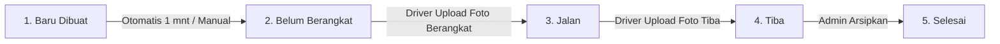

# KPM Line Feeding Tracking System 📦🚀

> **Sistem Informasi & Manajemen Kartu Permintaan Material (KPM) Line Feeding Real-time**  
> Mengintegrasikan Google Sheets sebagai basis data, Google Apps Script sebagai backend API & state machine, Google Drive sebagai media penyimpanan bukti foto, antarmuka Web Portal responsif (Netlify & Vercel), dan Aplikasi Mobile Driver Android Native (APK) berdesain **Google Material Design 3**.

---

## 📑 Daftar Isi

- [Arsitektur Sistem](#arsitektur-sistem)
- [Fitur Utama](#fitur-utama)
- [Aplikasi Mobile Driver Android (APK)](#aplikasi-mobile-driver-android-apk)
- [Desain Antarmuka Google Material Design 3](#desain-antarmuka-google-material-design-3)
- [Arsitektur Performa dan Caching](#arsitektur-performa-dan-caching)
- [Alur Status State Machine](#alur-status-state-machine)
- [Struktur Spreadsheet Kolom A Sampai X](#struktur-spreadsheet-kolom-a-sampai-x)
- [Keamanan dan Hak Akses RBAC](#keamanan-dan-hak-akses-rbac)
- [Spesifikasi API Backend](#spesifikasi-api-backend)
- [Panduan Instalasi dan Deployment](#panduan-instalasi-dan-deployment)
  - [1. Konfigurasi Google Apps Script](#1-konfigurasi-google-apps-script)
  - [2. Konfigurasi Web Portal (Netlify / Vercel)](#2-konfigurasi-web-portal-netlify--vercel)
  - [3. Build & Rilis APK Driver Android](#3-build--rilis-apk-driver-android)
  - [4. Menjalankan Lokal Development](#4-menjalankan-lokal-development)
- [Akses QR Code dan Link Unduhan](#akses-qr-code-dan-link-unduhan)
- [Pengujian Otomatis](#pengujian-otomatis)
- [Lisensi dan Pembuat](#lisensi-dan-pembuat)

---

## Arsitektur Sistem

```text
┌────────────────────────────────────────────────────────────────────────┐
│               APLIKASI DRIVER ANDROID (apps/driver-app)                │
│   - Vue 3 + Tailwind CSS (Google Material Design 3 Dark Theme)         │
│   - Capacitor 7 Native Android Engine                                  │
│   - Kamera Native Lingkungan + Kompresor Gambar Otomatis (<1 Detik)    │
│   - Koneksi Langsung (Direct API) ke Google Apps Script tanpa Proxy    │
└──────────────────────────────────┬─────────────────────────────────────┘
                                   │ Direct HTTPS POST / GET (Follow 302)
                                   ▼
┌────────────────────────────────────────────────────────────────────────┐
│                        WEB PORTAL (Netlify / Vercel)                   │
│   - Portal Admin (/kpm) & Portal Personel Web (/kpm/personel)          │
│   - Serverless Function Proxy (api/index.js / netlify/functions/api)   │
│   - Injeksi Token Otentikasi Sisi Server (Server-Side Token Injection) │
└──────────────────────────────────┬─────────────────────────────────────┘
                                   │ HTTPS POST / GET
                                   ▼
┌────────────────────────────────────────────────────────────────────────┐
│               BACKEND GOOGLE APPS SCRIPT (Web.gs)                      │
│   - Role-Based Access Control (Admin vs Driver Token Validation)       │
│   - Strict State Machine (Baru Dibuat ➔ Belum ➔ Jalan ➔ Tiba ➔ Selesai)│
│   - Concurrency Lock (LockService 15 detik)                            │
│   - Multi-item KPM Auto-sequencing & No LF Increment Generator         │
│   - Pre-Hashed Cryptographic Digital Seal & Anti-Tamper Protection     │
└───────────────────┬────────────────────────────────┬───────────────────┘
                    │                                │
                    ▼                                ▼
┌──────────────────────────────────────┐  ┌──────────────────────────────┐
│       DATABASE GOOGLE SHEETS         │  │     GOOGLE DRIVE STORAGE     │
│       Sheet: "KPM Monitor 2026"      │  │ Folder: Bukti_Pengiriman_KPM │
│ - 24 Kolom Data (A - X)              │  │ - Foto Bukti Keberangkatan   │
│ - Multi-material grouping            │  │ - Foto Bukti Ketibaan        │
│ - Formula durasi & hyperlink         │  │ - Akses Link Publik Terpadu  │
└──────────────────────────────────────┘  └──────────────────────────────┘
```

---

## Fitur Utama

1. **Dashboard Admin Modern**:
   - Pembuatan KPM multi-barang (hingga 100 material per nomor KPM).
   - Penomoran otomatis No. LF (contoh: `001/PPO/LF/VIII/2026`) dengan deteksi sekuens cerdas.
   - Live monitoring card dengan visual progress bar (0% - 100%), rincian barang yang dapat di-*expand*, durasi perjalanan, serta link foto bukti.
   - Filter instan berdasarkan status (`Semua`, `Baru Dibuat`, `Belum Berangkat`, `Jalan`, `Tiba`).
   - Fitur arsip sekali klik untuk memindahkan KPM tiba ke status `Selesai`.

2. **Aplikasi Mobile Driver Android Native**:
   - Antarmuka khusus smartphone berbasis Google Material Design 3.
   - Komunikasi langsung ke backend Google Apps Script (*Direct GAS API*).
   - Pengambilan foto langsung dari kamera (*native camera capture*) dengan kompresi kilat di sisi klien.
   - Dialog pengaturan koneksi mandiri (⚙️) untuk fleksibilitas endpoint URL dan token.

3. **Backend Aman & Terisolasi**:
   - Google Apps Script sebagai *Single Source of Truth* logika bisnis.
   - Manajemen rahasia berbasis `ScriptProperties` untuk keamanan token API.
   - Proteksi konkurensi dengan `LockService` untuk mencegah duplikasi penomoran KPM saat beberapa pengguna melakukan aksi bersamaan.
   - Proteksi tanda tangan digital kriptografis (*Pre-hashed SHA-256 Seal*) anti-tamper.

4. **Modul Cetak Dokumen & Pop-up**:
   - Modul cetak dokumen fisik KPM dengan pagination otomatis (15 item per halaman) di [`KPMn.gs`](file:///d:/MyCode/KPMscirpt/KPMn.gs) dan [`PrintKPM.html`](file:///d:/MyCode/KPMscirpt/PrintKPM.html).
   - Dialog pop-up yang diperbesar untuk kemudahan input data di Google Sheets (`MasterKPM`, `PrintKPM`, dan `AboutDialog`).

5. **Arsitektur Performa Tinggi & Multi-Tier Caching**:
   - Cache katalog material di memori RAM & `ScriptCache` ($O(1)$ lookup).
   - Pembacaan formula selektif 2 kolom foto (menghemat >60% network payload).
   - Penulisan bounded slice bertarget untuk pembaruan status dan sinkronisasi baris.
   - Kompresi gambar off-thread via `createImageBitmap` + `OffscreenCanvas`.

---

## Aplikasi Mobile Driver Android (APK)

Aplikasi mobile driver terletak pada direktori [`apps/driver-app`](file:///d:/MyCode/KPMscirpt/apps/driver-app) dan dikompilasi menjadi file APK mandiri.

### Keunggulan Driver App

- **Koneksi Langsung ke Google Apps Script**: Tidak memerlukan perantara server web pihak ketiga, bebas dari kendala redirect autentikasi SSO, dan langsung terhubung ke Google Sheets.
- **Signed Keystore Resmi**: Dibundel dengan signature release resmi untuk mencegah peringatan keamanan *Google Play Protect*.
- **Kompatibilitas Luas**: Mendukung Android 5.0 (Lollipop) hingga Android 15+.
- **Kompresi Gambar Cepat**: Mengompresi foto bukti muat dan tiba ke resolusi optimal 960px (~150KB) dalam hitungan milidetik sebelum dikirim ke Google Drive.
- **Rilis Otomatis GitHub Actions**: Setiap push atau rilis versi tag (misal: `v1.0.2`) secara otomatis mengompilasi, menandatangani, dan merilis file `.apk` siap unduh di tab **GitHub Releases**.

---

## Desain Antarmuka Google Material Design 3

Seluruh antarmuka web, mobile, dan dialog Google Apps Script telah distandardisasi mengikuti panduan desain **Google Material Design 3 (M3)**:

### 1. Psikologi Warna (Google 4-Color Palette)

- **Google Blue** (`#1a73e8` / `#4285f4`): Kepercayaan & Aksi Utama (Header, tombol navigasi, chip KPM, dan rute asal).
- **Google Red** (`#ea4335` / `#d93025`): Urgensi & Peringatan (Banner error, tombol reset foto, dan validasi gagal).
- **Google Yellow / Amber** (`#fbbc04` / `#f9ab00`): Optimisme & Status Berjalan (Badge status "Sedang Jalan", in-transit stepper).
- **Google Green** (`#34a853` / `#188038`): Pertumbuhan & Sukses (Status tiba di tujuan, konfirmasi berhasil, rute tujuan).

### 2. Gradien & Kedalaman Visual

- Garis aksen pelangi 4 warna Google (`linear-gradient(90deg, #4285f4, #ea4335, #fbbc04, #34a853)`).
- Efek elevasi berlapis Material 3 (`shadow-m3-1` hingga `shadow-m3-4`).
- Glassmorphism lembut pada header dialog dan top bar.

### 3. Bentuk & Tipografi

- Tombol kapsul (*pill buttons*, `rounded-full`) untuk kemudahan interaksi sentuhan.
- Kartu permukaan melengkung halus (`rounded-2xl` & `rounded-3xl`).
- Tipografi modern Google (*Plus Jakarta Sans*, *Roboto*, dan *IBM Plex Mono*).

---

## Arsitektur Performa dan Caching

Untuk menjamin kecepatan, skalabilitas, dan responsivitas tinggi pada koneksi internet seluler maupun desktop:

1. **Multi-Tier Caching (RAM ➔ `ScriptCache` ➔ Storage)**:
   - **Katalog Material (`Code.gs`)**: Seluruh database material di-load ke RAM dan `ScriptCache` (TTL 6 jam) dengan chunking aman (>100KB). Fungsi `getMaterialByKode(kode)` melakukan pencarian $O(1)$ instan tanpa query spreadsheet.
   - **Aset Gambar / Logo (`Code.gs` & `About.gs`)**: Logo aplikasi dan header cetak di-cache 3 lapis untuk menghilangkan latensi DriveApp RPC.
   - **Target Google Drive Folder (`Web.gs`)**: ID folder tujuan pengiriman di-cache di `ScriptCache`, menghilangkan pencarian direktori $O(N)$ pada setiap upload foto.

2. **Optimasi Spreadsheet I/O & Network Payload**:
   - **Targeted Formula Fetch**: Pembacaan monitoring hanya meminta formula pada 2 kolom foto (Kolom W & X), memangkas data transfer >60%.
   - **Selective Slice Write-Back**: Pembaruan status KPM hanya menulis kembali irisan baris yang berubah (`allData.slice(minIdx, maxIdx + 1)`), bukan seluruh ribuan baris spreadsheet.
   - **Downstream Sync Precise Slice**: Sinkronisasi downstream metadata pada `onEdit` hanya menulis kembali baris yang benar-benar terscan.
   - **Eliminasi `SpreadsheetApp.flush()`**: Menghapus pemanggilan blocking flush agar write-behind spreadsheet berjalan efisien dan asinkron.

3. **Frontend Acceleration**:
   - **Off-Thread Image Compression**: `compressImage()` memanfaatkan `createImageBitmap` dan `OffscreenCanvas` untuk *decoding* dan *resizing* foto di *background thread* tanpa memblokir UI browser.
   - **Smart Invalidation & On-Demand Sync**: Tombol "↻ Segarkan" mem-bypass cache secara eksplisit untuk sinkronisasi seketika.

---

## Alur Status State Machine

Sistem memberlakukan alur status berurutan yang ketat (*Strict State Machine*) untuk mencegah perubahan status ilegal:



| Status | Kode Status | Hak Akses | Deskripsi & Syarat Transisi |
| :--- | :---: | :---: | :--- |
| **Baru Dibuat** | `BARU_DIBUAT` | Admin | Status awal saat KPM dibuat oleh Admin. KPM belum siap diambil driver. |
| **Belum Berangkat** | `BELUM_BERANGKAT` | Admin / Sistem | Otomatis berubah setelah 1 menit atau diubah admin. KPM muncul di portal Driver. |
| **Jalan** | `BERANGKAT` | Driver / Admin | Driver memulai perjalanan. **Wajib melampirkan foto bukti keberangkatan.** Waktu berangkat dicatat otomatis. |
| **Tiba** | `TIBA` | Driver / Admin | Driver sampai di tujuan. **Wajib melampirkan foto bukti tiba.** Durasi perjalanan dihitung otomatis. |
| **Selesai** | `SELESAI` | Admin | KPM telah tuntas dan diarsipkan dari tampilan monitoring harian. |

---

## Struktur Spreadsheet Kolom A Sampai X

Data KPM disimpan pada sheet **`KPM Monitor 2026`** mulai dari baris 10:

| Kolom | Nama Kolom di Spreadsheet | Konstanta di Script | Tipe Data | Deskripsi |
| :---: | :--- | :--- | :---: | :--- |
| **A** | `NO ( Oto )` | `MONITOR_COL_NO` (1) | Integer | Nomor urut baris data |
| **B** | `Post Date ( Otomatis )` | `MONITOR_COL_POST_DATE` (2) | String | Waktu pembuatan (`dd/MM/yyyy HH:mm:ss`) |
| **C** | `No. LF ( Counting Manual )` | `MONITOR_COL_NOLF` (3) | String | Nomor KPM unik (`001/PPO/LF/VIII/2026`) |
| **D** | `Item` | `MONITOR_COL_ITEM` (4) | Integer | Urutan item material (`1`, `2`, `3`, ...) |
| **E** | `Kode Material` | `MONITOR_COL_KODE` (5) | String | Kode material dari database |
| **F** | `Spesifikasi ( Semi - Otomatis )` | `MONITOR_COL_SPEK` (6) | String | Nama / deskripsi material |
| **G** | `WBS` | `MONITOR_COL_WBS` (7) | String | Kode WBS proyek |
| **H** | `Proyek` | `MONITOR_COL_PROYEK` (8) | String | Nama proyek tujuan |
| **I** | `Type Car` | `MONITOR_COL_TYPECAR` (9) | String | Tipe car / gerbong |
| **J** | `TS/Batch/Set` | `MONITOR_COL_BATCH` (10) | String | Nomor batch / set |
| **K** | `Qty Diminta` | `MONITOR_COL_QTY` (11) | Number | Jumlah barang diminta |
| **L** | `Qty Diserahkan` | `MONITOR_COL_QTYDISERAHKAN` (12) | Number | Jumlah barang diserahkan |
| **M** | `UoM` | `MONITOR_COL_UOM` (13) | String | Satuan (`PCS`, `M`, `UNIT`, `SET`, `SHT`, dll.) |
| **N** | `SN` | `MONITOR_COL_SN` (14) | String | Serial Number |
| **O** | `PIC KPM` | `MONITOR_COL_PIC` (15) | String | Nama PIC (`AANG`, `EKO`, `RULI`, `EGI`, `NUGRAHA`, `TAUFIQ`) |
| **P** | `Keteranagn` | `MONITOR_COL_KET` (16) | String | Keterangan tambahan |
| **Q** | `Dari` | `MONITOR_COL_WSAWAL` (17) | String | Workshop asal keberangkatan |
| **R** | `Tujuan` | `MONITOR_COL_WSTUJUAN` (18) | String | Workshop tujuan kedatangan |
| **S** | `Waktu Berangkat` | `MONITOR_COL_WKT_BERANGKAT` (19) | String | Timestamp saat driver menekan *Jalan* |
| **T** | `Waktu Tiba` | `MONITOR_COL_WKT_TIBA` (20) | String | Timestamp saat driver menekan *Tiba* |
| **U** | `Durasi` | `MONITOR_COL_DURASI` (21) | String | Durasi otomatis (`HH:mm:ss`) |
| **V** | `Status Tracking` | `MONITOR_COL_STATUS` (22) | String | Dropdown validasi status KPM |
| **W** | `Foto Beragkat` | `MONITOR_COL_FOTO_BER` (23) | Formula | `=HYPERLINK("drive_url", "[Link]")` |
| **X** | `Foto Tiba` | `MONITOR_COL_FOTO_TIB` (24) | Formula | `=HYPERLINK("drive_url", "[Link]")` |

---

## Keamanan dan Hak Akses RBAC

Sistem menggunakan otorisasi berbasis peran ganda (*Role-Based Access Control*) yang dikontrol secara server-side:

| Aksi API | Endpoint Method | Peran ADMIN | Peran DRIVER / USER | Keterangan |
| :--- | :---: | :---: | :---: | :--- |
| `getMasterData` | `GET` | ✅ Diizinkan | ✅ Diizinkan | Mengambil daftar workshop, PIC, UOM, dan status |
| `getMonitoring` | `GET` | ✅ Diizinkan | ❌ Ditolak (403) | Mengambil daftar KPM aktif beserta progres |
| `getDeliveries` | `GET` | ✅ Diizinkan | ✅ Diizinkan | Mengambil KPM yang siap diupdate driver |
| `createKpm` | `POST` | ✅ Diizinkan | ❌ Ditolak (403) | Membuat KPM dan baris material baru |
| `updateStatus` | `POST` | ✅ Diizinkan | ✅ Diizinkan | Memperbarui status, upload foto, isi durasi |
| `archiveKpm` | `POST` | ✅ Diizinkan | ❌ Ditolak (403) | Mengubah status menjadi `Selesai` |

---

## Spesifikasi API Backend

Semua endpoint Google Apps Script mengembalikan format amplop terpadu (*Unified Response Envelope*):

### Format Sukses (`HTTP 200`)

```json
{
  "success": true,
  "action": "createKpm",
  "data": {
    "kpmId": "001/PPO/LF/VIII/2026",
    "nomor": "001/PPO/LF/VIII/2026",
    "itemCount": 2,
    "status": "Baru Dibuat",
    "statusCode": "BARU_DIBUAT"
  },
  "error": null
}
```

### Format Error (`HTTP 200` dengan envelope error)

```json
{
  "success": false,
  "action": "updateStatus",
  "data": null,
  "error": {
    "code": "INVALID_TRANSITION",
    "message": "Transisi status tidak valid: Tidak dapat mengubah status dari 'Baru Dibuat' ke 'Tiba'."
  }
}
```

---

## Panduan Instalasi dan Deployment

### 1. Konfigurasi Google Apps Script

1. Buka spreadsheet Google Sheets Anda.
2. Buka **Extensions** → **Apps Script**.
3. Salin file script berikut:
   - [`Web.gs`](file:///d:/MyCode/KPMscirpt/Web.gs) (Controller API & State Machine)
   - [`KPMn.gs`](file:///d:/MyCode/KPMscirpt/KPMn.gs) (Engine Spreadsheet & Print Modul)
   - [`Code.gs`](file:///d:/MyCode/KPMscirpt/Code.gs) (Menu UI & Dialog)
   - [`About.gs`](file:///d:/MyCode/KPMscirpt/About.gs), [`AboutDialog.html`](file:///d:/MyCode/KPMscirpt/AboutDialog.html), [`MasterKPM.html`](file:///d:/MyCode/KPMscirpt/MasterKPM.html), [`PrintKPM.html`](file:///d:/MyCode/KPMscirpt/PrintKPM.html)
   - [`Test.gs`](file:///d:/MyCode/KPMscirpt/Test.gs) (Unit test suite)
4. Atur **Script Properties**:
   - Buka **⚙️ Project Settings** → **Script Properties**.
   - Tambahkan property:
     - `ADMIN_TOKEN` = `(Token rahasia Admin Anda)`
     - `DRIVER_TOKEN` = `(Token rahasia Driver Anda)`
     - `ABOUT_LOGO_ID` = `(Google Drive ID untuk logo modal About)` *(Opsional)*
     - `KPM_LOGO_ID` = `(Google Drive ID untuk logo cetak KPM)` *(Opsional)*
5. Jalankan inisialisasi:
   - Pilih fungsi `setupTrackingHeaders` pada toolbar lalu klik **▶ Run**.
6. Deploy Web App:
   - Klik **Deploy** → **New deployment** (atau **Manage deployments** → **✏️ Edit** → **New version**).
   - Pilih jenis: **Web app**.
   - **Execute as:** `Me (akun Anda)`.
   - **Who has access:** `Anyone` (*Siapa saja*).
   - Klik **Deploy** dan salin URL Web App (`https://script.google.com/macros/s/.../exec`).

### 2. Konfigurasi Web Portal (Netlify / Vercel)

1. Buka project Anda di dashboard Netlify atau Vercel.
2. Buka **Settings** → **Environment Variables**.
3. Tambahkan 3 variabel lingkungan:

   ```env
   GOOGLE_SCRIPT_URL=https://script.google.com/macros/s/AKfycbxXRRDoiIXVt8VwUa7Gq-ZUdEP4YZhHiMoTdPKnSZ4eWMNBclUmQ5d86Zqoaxo76OM1jg/exec
   ADMIN_TOKEN=7fK9xQ2mL8vR4nT6pZ1wC5yH3sD9aJ8uE2gN6bX4qW7rM
   DRIVER_TOKEN=A9vX3kP7mQ2rT8zL5nC1wH6dF4sJ9yB7uG2eR8xN5pK3
   ```

### 3. Build & Rilis APK Driver Android

#### Kompilasi Otomatis (GitHub Actions)

Setiap perubahan kode yang di-push ke branch atau pemberian tag rilis (misal: `git tag v1.0.2 && git push origin v1.0.2`) akan otomatis memicu GitHub Actions untuk mengompilasi file APK rilis bertanda tangan resmi (*signed release*) dan mengunggahnya ke **GitHub Releases**.

#### Kompilasi Manual di Komputer Lokal

```bash
cd apps/driver-app
npm install
npm run build
npx cap sync android
cd android
./gradlew assembleRelease
```

File APK yang sudah ditandatangani keystore resmi berada di:  
`apps/driver-app/android/app/build/outputs/apk/release/app-release.apk`

### 4. Menjalankan Lokal Development

```bash
# Menjalankan Web Portal
cd WKPM/combined-app
npm install
npm run dev

# Menjalankan Driver Mobile Web
cd apps/driver-app
npm install
npm run dev
```

---

## Akses QR Code dan Link Unduhan

| Portal / Aplikasi | URL Publik / Link Unduhan | QR Code File |
| :--- | :--- | :---: |
| **Aplikasi Driver Mobile (APK)** | **[Unduh di GitHub Releases](https://github.com/SepTGut/KPMscirpt/releases)** | *(File APK Android)* |
| **Web Portal Admin** | `https://combined-app-theta.vercel.app/kpm` | [`qr code/qr_admin_kpm.png`](file:///d:/MyCode/KPMscirpt/qr%20code/qr_admin_kpm.png) |
| **Web Portal Driver** | `https://combined-app-theta.vercel.app/kpm/personel` | [`qr code/qr_personel_driver.png`](file:///d:/MyCode/KPMscirpt/qr%20code/qr_personel_driver.png) |
| **Kartu Cetak Siap Print** | Buka di browser: [`qr code/print_qr_codes.html`](file:///d:/MyCode/KPMscirpt/qr%20code/print_qr_codes.html) | *(Halaman Cetak A4)* |

---

## Pengujian Otomatis

Aplikasi dilengkapi test suite menyeluruh di [`Test.gs`](file:///d:/MyCode/KPMscirpt/Test.gs):

1. `testWebAuthentication`: Verifikasi penolakan token kosong, token salah, dan pembatasan hak akses role driver.
2. `testWebCreationStatusLockdown`: Memastikan KPM baru dipaksa berstatus `Baru Dibuat`.
3. `testWebMalformedJsonRejection`: Memastikan JSON material yang rusak ditolak secara tepat.
4. `testWebInvalidRouteRejection`: Memastikan workshop/rute yang tidak terdaftar ditolak.
5. `testSystemIntegrityVerification`: Memvalidasi integritas digital seal kriptografis anti-tamper.
6. `testWebStateMachineValidations`: Menguji siklus lengkap 7 langkah:
   - Step 1: Create KPM
   - Step 2: Blokir loncatan status ilegal (`Baru Dibuat` ➔ `Tiba`)
   - Step 3: Transisi `Baru Dibuat` ➔ `Belum Berangkat`
   - Step 4: Blokir keberangkatan tanpa foto
   - Step 5: Keberangkatan valid dengan bukti JPEG
   - Step 6: Ketibaan valid dengan bukti JPEG & hitung durasi
   - Step 7: Pengarsipan `Selesai`
   - *Pembersihan:* Otomatis menghapus baris test di spreadsheet dan file foto di Google Drive.

---

## Lisensi dan Pembuat

- **Pengembang:** Setyo Guntur Samudro
- **Instansi:** SMK Negeri 1 Madiun
- **Jurusan / Fakultas:** T.I.T.L (Teknik Instalasi Tenaga Listrik)
- **Sistem:** KPM Line Feeding Tracking System (v8.0.0, 2026)
- **Lisensi:** Hak cipta dan logika bisnis dilindungi oleh modul integritas kriptografis [`About.gs`](file:///d:/MyCode/KPMscirpt/About.gs).
