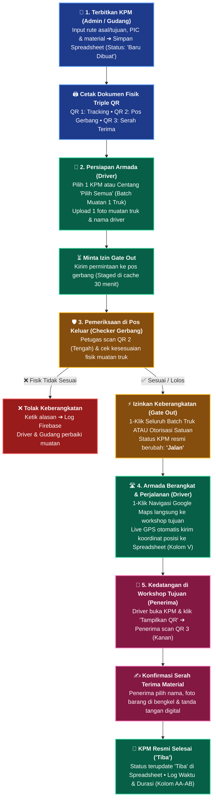

# Panduan Alur Proses KPM Line Feeding (End-to-End Process Flow)
Dokumen resmi standar operasional sistem **KPM Line Feeding**, mencakup alur lengkap dari pembuatan dokumen, pengiriman armada, verifikasi gerbang, hingga serah terima penerima untuk **Pengguna (User)** dan **Administrator (Admin)**.

---

## 1. Peran & Tanggung Jawab Pengguna (User Roles)

| Peran | Tanggung Jawab Utama | Antarmuka Aplikasi |
| :--- | :--- | :--- |
| **Admin / PPIC / Gudang** | Membuat KPM, mencetak lembar fisik (Triple QR), memonitor seluruh status perjalanan, mengelola arsip dan data master. | Portal Admin: Form Buat KPM, Monitoring Board, Arsip, Kelola User. |
| **Driver / Supir Pengiriman** | Menerima muatan fisik, inisialisasi keberangkatan (satuan / batch), mengambil foto muatan, mengaktifkan GPS rute, dan menampilkan QR serah terima ke penerima. | Portal Driver: Daftar KPM, Inisialisasi Keberangkatan, GPS Live, QR Serah Terima. |
| **Checker / Petugas Pos Gerbang** | Memeriksa kesesuaian fisik muatan kendaraan saat keluar gerbang pabrik asal (*Gate Out*), memberi izin jalan (satuan atau 1-klik seluruh batch truk), atau menolak jika tidak sesuai. | Portal Checker: Input/Scan QR 2 Checker, Verifikasi Muatan Fisik, Otorisasi Gate Out. |
| **Penerima / Workshop Tujuan** | Menerima material di bengkel tujuan, men-scan QR 3 Serah Terima, memilih/mengisi nama penerima, melampirkan foto barang, dan menandatangani secara digital. | Portal Konfirmasi Penerima: Scan QR 3 / Buka Short Link, Konfirmasi Kedatangan. |

---

## 2. Diagram Visual Alur Proses (Flowchart)



---

## 3. Rincian Fase demi Fase

### Fase 1: Pembuatan & Pencetakan KPM (Admin / Gudang)
1. **Pembuatan KPM**:
   - Admin atau PPIC membuka menu **"Buat KPM Baru"**.
   - Mengisi rute asal (Workshop Asal) dan rute tujuan (Workshop Tujuan), PIC, nomor proyek, tanggal kebutuhan, dan daftar material (kode barang, nama/spesifikasi, kuantitas, UOM).
   - Klik **"Simpan & Terbitkan KPM"**.
2. **Penyimpanan di Spreadsheet**:
   - Baris KPM otomatis tercatat pada sheet `MONITOR KPM` dengan status awal: `Baru Dibuat` / `Belum Berangkat`.
3. **Format Triple QR Code pada Lembar Fisik**:
   Saat dicetak melalui menu cetak, lembar KPM memuat **3 QR Code** dengan fungsi spesifik:
   - **QR 1 (Kiri - Tracking Publik)**: Mengarah ke portal pelacakan umum untuk memantau progres KPM.
   - **QR 2 (Tengah - Checker Pos Gerbang)**: Mengarah ke portal verifikasi pos gerbang keluar untuk pemeriksaan satpam/checker.
   - **QR 3 (Kanan - Serah Terima Penerima)**: Mengarah ke tautan ringkas serah terima material khusus penerima di lokasi bongkar.

---

### Fase 2: Persiapan & Inisialisasi Keberangkatan (Driver)
1. **Pemeriksaan Tugas Pengiriman**:
   - Driver membuka portal **Driver Delivery**.
   - Seluruh KPM yang siap dikirim muncul pada daftar tugas.
2. **Pilihan Pengiriman Satuan atau Batch (Truk Penuh)**:
   - **Pengiriman Satuan**: Driver mengklik satu kartu KPM.
   - **Pengiriman Batch (Banyak KPM)**: Driver memberi tanda centang pada kartu-kartu KPM yang dibawa dalam satu truk, atau menekan tombol shortcut **"✓ Pilih Semua"**.
3. **Input Data Keberangkatan**:
   - Mengisi nama driver (tersedia tombol uji cepat *IT/ST*).
   - Mengambil 1 foto muatan truk menggunakan kamera ponsel (opsional, mewakili seluruh KPM dalam batch).
4. **Permintaan Izin Gerbang**:
   - Driver menekan tombol **"Minta Izin Checker (Gate Out)"**.
   - Sistem menyimpan status persiapan (*staged*) di memory cache selama 30 menit.
   - Layar driver menampilkan jendela tunggu verifikasi Checker pos gerbang dengan indikator sinyal aktif (*live pulse*).

---

### Fase 3: Pemeriksaan Pos Gerbang Keluar (Checker / Satpam)
1. **Pemeriksaan Fisik**:
   - Driver menghentikan kendaraan di pos gerbang keluar pabrik asal.
   - Petugas Checker memeriksa kesesuaian fisik muatan di bak truk dengan lembar dokumen KPM.
2. **Scan / Buka Portal Checker**:
   - Petugas Checker men-scan **QR 2 (Tengah)** pada lembar fisik KPM, atau memilih KPM dari daftar aktif.
3. **Deteksi Batch Otomatis**:
   - Jika driver membawa banyak KPM sekaligus, sistem otomatis mendeteksi:
     > **"Muatan Truk Batch Terdeteksi (X KPM) - 1 Armada Truk"**
     > Menampilkan nomor-nomor KPM yang tergabung dalam muatan truk tersebut.
4. **Keputusan Otorisasi Checker**:
   - **Opsi A - Izinkan Semua (1-Klik)**: Checker menekan tombol hijau **"✓ Izinkan Seluruh Batch (X KPM Sekaligus)"**. Seluruh KPM langsung resmi berstatus `Jalan`.
   - **Opsi B - Izinkan Satuan**: Checker dapat memilih untuk meloloskan KPM yang sedang dilihat saja.
   - **Opsi C - Tolak Keberangkatan**: Jika ada barang yang kurang, rusak, atau dokumen tidak sesuai, Checker menekan **"Tolak Keberangkatan"** dan memasukkan alasan penolakan.
     - Penolakan tercatat di Firebase audit log.
     - Driver langsung menerima peringatan di layarnya mengenai alasan penolakan agar dapat diperbaiki bersama gudang.

---

### Fase 4: Perjalanan & Pelacakan GPS (Driver & Sistem)
1. **Pembaruan Otomatis Layar Driver**:
   - Begitu Checker menyetujui di gerbang, modal tunggu driver otomatis tertutup dan KPM berstatus `Jalan`.
2. **Navigasi Rute 1-Klik**:
   - Driver dapat menekan tombol **"Buka Navigasi Rute di Google Maps"** untuk langsung membuka rute tercepat ke workshop tujuan.
3. **Live GPS Tracking**:
   - Ponsel driver memperbarui koordinat posisi (*latitude, longitude, akurasi, dan kecepatan*) ke Google Spreadsheet.
   - Tautan `🔴 Live Track` otomatis aktif di spreadsheet pada kolom V.

---

### Fase 5: Kedatangan & Serah Terima Material (Penerima)
1. **Kedatangan di Tujuan**:
   - Saat tiba di bengkel/workshop tujuan, Driver membuka KPM tersebut dan memilih aksi **"Tiba"**.
   - Mengambil foto bukti kedatangan truk di workshop tujuan.
   - Menekan tombol **"Tampilkan QR Penerima"**.
2. **Serah Terima Digital (Tanpa Perlu Login)**:
   - Petugas penerima di bengkel tujuan men-scan **QR 3 (Kanan)** pada lembar fisik KPM atau membuka tautan yang dibagikan driver.
   - Halaman konfirmasi terbuka di ponsel penerima:
     - Penerima memilih namanya dari daftar master penerima (atau mengetik nama manual).
     - Mengambil foto kondisi barang yang diterima (opsional).
     - Menekan tombol **"Konfirmasi Penerimaan Material"**.
3. **Penutupan Tiket Real-time**:
   - Sistem mencatat konfirmasi penerimaan.
   - Layar ponsel Driver otomatis menampilkan animasi centang hijau: **"Barang Resmi Diterima oleh [Nama Penerima]!"** dan memperbarui daftar tugas.

---

### Fase 6: Penyelesaian, Audit, & Arsip Otomatis (Sistem & Admin)
1. **Pencatatan Lengkap di Spreadsheet**:
   - Kolom R: Waktu Berangkat (Format: `DD/MM/YYYY HH:mm:ss`)
   - Kolom S: Nama Driver
   - Kolom T: Waktu Tiba
   - Kolom U: Durasi Perjalanan Otomatis (dihitung selisih waktu)
   - Kolom W: Tautan Foto Berangkat
   - Kolom X: Tautan Foto Tiba
   - Kolom AA: **Nama Penerima Barang**
   - Kolom AB: **Tautan Foto Bukti Diterima**
2. **Cold Archive di Sheet `T.Log`**:
   - Riwayat pengiriman diarsipkan secara permanen ke sheet log historis untuk pelaporan bulanan dan audit PPIC.
3. **Monitoring Admin**:
   - Di dashboard admin, status KPM otomatis berubah menjadi hijau (`Tiba` / `Selesai`) tanpa perlu tindakan manual.

---

## 4. Matriks Transisi Status KPM (Status Lifecycle)

```
[Baru Dibuat] 
      │
      ▼
[Belum Berangkat] ──(Driver Minta Izin: Staged)──► [Menunggu Verifikasi Gerbang]
      │                                                        │
      │                                       ┌────────────────┴────────────────┐
      │                                       ▼                                 ▼
      │                          [Ditolak Checker]                   [Diverifikasi Checker]
      │                                       │                                 │
      │                                       ▼                                 ▼
      └─────────(Perbaiki Muatan)─────────────┘                              [Jalan]
                                                                                │
                                                                                ▼
                                                                             [Tiba]
                                                                                │
                                                                                ▼
                                                                            [Selesai]
```

---

## 5. Pemetaan Kolom Google Spreadsheet (Monitoring Sheet)

| Kolom | Kode Huruf | Nama Kolom | Sumber Pengisian |
| :---: | :---: | :--- | :--- |
| **1** | A | No Urut | Sistem (Auto Sequence) |
| **2** | B | No KPM / LF | Admin Form Buat KPM |
| **3** | C | Tanggal Posting | Admin Form Buat KPM |
| **8** | H | Status KPM | Mesin Status GAS (`Baru Dibuat` ➔ `Jalan` ➔ `Tiba`) |
| **10** | J | Workshop Asal | Admin Form Buat KPM |
| **11** | K | Workshop Tujuan | Admin Form Buat KPM |
| **12** | L | PIC Pengirim | Admin Form Buat KPM |
| **13** | M | Kode Barang | Admin Form Buat KPM |
| **14** | N | Spesifikasi / Nama Barang | Admin Form Buat KPM |
| **15** | O | Qty Material | Admin Form Buat KPM |
| **16** | P | Satuan / UOM | Admin Form Buat KPM |
| **17** | Q | Nama Proyek | Admin Form Buat KPM |
| **18** | R | Waktu Berangkat | Checker Pos Gerbang (Saat Izin Keluar Diberikan) |
| **19** | S | Nama Driver | Portal Driver (Saat Inisialisasi Keberangkatan) |
| **20** | T | Waktu Tiba | Penerima (Saat Konfirmasi Penerimaan) |
| **21** | U | Durasi Pengiriman | Rumus Otomatis GAS (`Waktu Tiba - Waktu Berangkat`) |
| **22** | V | GPS Track URL | GPS Composable Ponsel Driver |
| **23** | W | Foto Bukti Berangkat | Foto Muatan Truk Driver (Google Drive Link) |
| **24** | X | Foto Bukti Tiba | Foto Truk Tiba Driver (Google Drive Link) |
| **25** | Y | Catatan / Keterangan | Checker / Admin |
| **26** | Z | Status Arsip | Tombol Arsip Admin (`ARCHIVED`) |
| **27** | AA | **Nama Penerima** | Form Konfirmasi Penerima (Penerima Workshop) |
| **28** | AB | **Foto Bukti Diterima** | Foto Barang Diterima (Google Drive Link) |

---

## 6. Pertanyaan Umum & Panduan Solusi (FAQ & Troubleshooting)

### Q1: Apa yang harus dilakukan jika Checker menolak keberangkatan KPM?
- **Penyebab**: Checker menemukan ketidaksesuaian barang di bak truk dengan surat KPM.
- **Solusi**: Driver membaca alasan penolakan di layar HP, berkoordinasi kembali dengan tim gudang/PPIC untuk memperbaiki muatan, lalu driver menekan tombol **"Minta Izin Checker"** sekali lagi setelah muatan beres.

### Q2: Bagaimana jika driver membawa 5 KPM sekaligus dalam satu truk?
- **Solusi**: Driver cukup memberi tanda centang pada kelima KPM tersebut (atau klik **"✓ Pilih Semua"**), ambil 1 foto bak truk, dan klik **"Minta Izin Checker untuk 5 KPM Sekaligus"**. Di pos gerbang, Checker cukup menekan **"✓ Izinkan Seluruh Batch (5 KPM Sekaligus)"** dengan 1 kali klik.

### Q3: Apakah Penerima Barang di workshop harus mempunyai akun login?
- **Tidak perlu**. Penerima cukup men-scan **QR 3 (Kanan)** pada lembar kertas KPM atau mengklik link konfirmasi dari driver melalui peramban HP biasa tanpa perlu login akun khusus.

### Q4: Bagaimana jika koneksi internet di pos gerbang atau workshop penerima lambat?
- Foto bukti otomatis dikompresi di browser (di bawah 300KB) sebelum dikirim, dan sistem menggunakan arsitektur *ScriptCache* untuk pengecekan status yang sangat cepat (< 1 detik).
